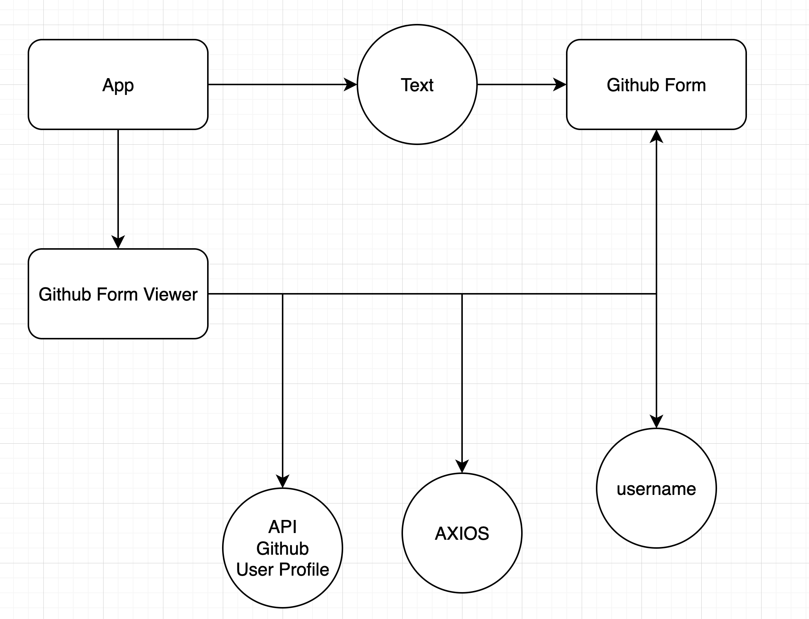
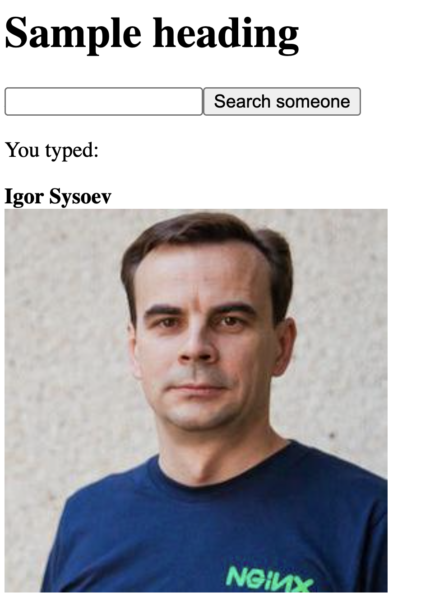

# Github profile

Explicit definition




First run 
```
bash
npm install axios
```

Create two `jsx` files in your main `App` component
```jsx
import GithubForm from "./GithubForm"
import GithubFormViewer from "./GithubFormViewer"

export default function App(){
    return (
        <>
            <h1>Sample heading</h1>
            <GithubFormViewer/>
            {/* <GithubForm/> */}
        </>
    )
}
```

Create first component that is responsible for searching the term
```jsx
import { useState } from "react";

export default function GithubForm ({search}){
    const [text, setText] = useState();

    function handleChange(event) {
      setText(event.target.value);
    }

    function handleSubmit(event) {
        event.preventDefault();
        search(text);
        setText("");
    }
  
    return (
        <form onSubmit={handleSubmit}>
            <input value={text} onChange={handleChange} />
            <button>Search someone</button>
            <p>You typed: {text}</p>
        </form>
    );
}
```
Create second component with `useState`, `useEffect`, `axios` get requrest and embed `GithubForm` component into resulting button

```jsx
import axios from "axios";
import { useEffect, useState } from "react";
import GithubForm from "./GithubForm";

const BASE_URL = "https://api.github.com/users";

export default function GithubFormViewer() {

    // declare state for username, for profile

    const [username, setUsername] = useState("gvanrossum");

    const [profile, setProfile] = useState({data: null, isLoading: true});
    // useEffect - sync with github api

    useEffect(
        function fetchUserOnUsernameChange(){
            async function fetchUser() {
                const userResult = await axios.get(`${BASE_URL}/${username}`)
                setProfile({data: userResult.data, isLoading: false});
            }
            fetchUser();
        }, [username]
    );


    // function search({username}) = > input - username, output - image and profile name

    function search(username){
        setProfile({data: null, isLoading: true});
        setUsername(username);
    }

    // message for client user when loading happens
    if(profile.isLoading) return <i>Page is loading... we are looking user</i>;

    return (
        <div>
            <GithubForm search={search} />
            <b>{profile.data.name}</b>
            <br/>
            
        </div>
    );

}
```

# Results 




